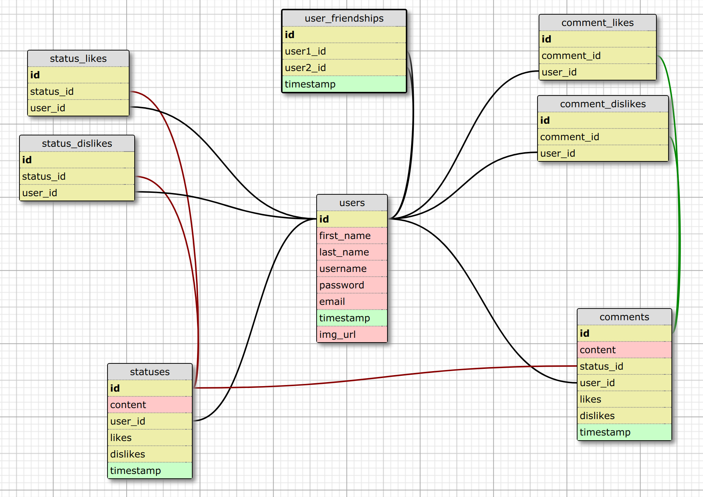

# _socialCodus - A social networking site for Epicodus students_

#### CSS/C# - Group Week Project

#### By **Joshua Fairchild, Guy Anderson, Arianna Chau, and Rose Sponseller, June 19-22, 2017**

## Description

Description coming soon! &#128175;

## Screenshots of Application

Landing page

Branding guide for application

Flowchart for database tables

## Specs
| Behavior | Input | Output |
|---|---|---|
| Program will display home landing page  | none | Welcome to socialCodus, account sign up, account login  |
| Program will take 6 user inputs to create a new account | Text: first name, last name, username, email, password, confirm password  | Joe, Schmoe, Jschmoe, jschmoe@gmail.com, password, password |
| Program will save user entries to database for later use | see above | see below |
| At account creation, program will check for previously used usernames. | duplicate 'Jschmoe' names | 'That username is already in use.' |
| At account creation, program will check for matching passwords. | password/wordpass | 'Both passwords must match.' |
| At account creation, program will check for valid email format. | jschmoegmail.com | 'Please include an @ in the email address.' |
| Program will take 2 user inputs to log in to an existing account | username/password| Jschmoe/password |
| At account log in, program will check for valid username. | Joe/ Jschmoe | No account with that username exists. |
| At account log in, program will check for valid password | wordpass/password | 'Invalid password.' |
| Program will take user to newsfeed view from login screen | button click/Sign Up, button click/Log in (assuming no errors found, see above) | Newsfeed view |
| Program will display newsfeeds view. | see above | Links to My Profile, Friends, Edit Profile, Search bar, Hi [user], Write a post, posts from friends, Sign out |
| Newsfeed view will display all posts created by the user and the users friends. | Joe: 'What a beautiful morning!' -or- user and friends have made no posts | 'What a beautiful morning!' -or- 'Your timeline is empty.' |
| Newsfeed view will have a link to My Profile | click | user profile view |
| Program will display Profile view. | none | Links to Home, Friends, Edit Profile, Search bar, Upload photo, Friends list,  all posts made by the user, Hi [user], Write a post, Sign out, user name, username, date joined, email, |
| Program will allow user to upload a picture to use as their profile picture | copy URL of a picture from the internet, paste in text box for entry, click upload button | Selected image will display where user image is used.|
| On profile view and news view, program will display a text box for entering a post, and a button to commit the update | text - Good morning! /click | Good Morning! |
| Posts will have the ability for users to like or dislike. | click like -or- dislike | like -or- dislike counter display + 1 |
| Likes and dislikes can only be made to posts and comments of users that are followed. | Click | like -or- dislike counter display + 1 |
| Posts will have a text box for users to enter a reply. | Text - Yes it is! / Click submit | "Good morning!" / Yes it is! |
| Pages other than landing page will have a Friends link | Click | Return friends view |
| Friends view | none | List and links to all friends -or- 'Uh-oh, it appears you have no friends!', if you have no matched friends yet. |
| Pages other than landing page and newsfeed views, will have a Home link | Click | Return to Newsfeed view. |
| All views other than the landing page, will display a Sign out link. | Click | log user out, return to socialCodus landing page. |
| All views other than the landing page, will display a Search window. Program will search database for matches to first name, last name, and username. | Bob | list of all users where 'Bob' is found in the first, last and username. |
| Program will display the results of a search query, results will be links to the pages of the found users. | Bob | Bob's profile page |
| Profile page of non-friends will have a button to 'Follow'  | click | Accounts are now linked as friends. |
| Users may not post on the profile page of non-friends | none | none |
| Profile page of non-friends will have a button to 'Unfollow' | click | Accounts are now unlinked as friends. |
| Previous posts on user newsfeed, made by Unfollowed users, will be removed. | none | none |
| All views will display an Edit Profile link. | Click | Take user to Edit Profile view |
| Edit Profile view will display an entry for first name, last name, username, email, password, and confirm password | Entry field - Name: Joe, User entry - Joey |  (Name Joe updated to) Joey |
| Edit Profile view will display a Delete Account button | Click | Account will be deleted, user will be returned to the account socialCodus landing page.|

## Setup/Installation Requirements

* You must install or have installed:

   * [SQL Server Management Studio](https://docs.microsoft.com/en-us/sql/ssms/download-sql-server-management-studio-ssms)

   * [Nancy web framework](http://nancyfx.org/)

   * [ASP.NET Core](https://www.microsoft.com/net/download/core)

* Clone this repository

  `git clone https://github.com/avocadobravado/social-media-project`

* Navigate to the root directory

## Database/Server Setup

*  Open Microsoft SQL Server Management Studio

* Select *File > Open > File* and select your database of choice from the root directory (social_media.sql for running the application, or social_media_test.sql for running tests)

* If the database does not already exist, add the following lines to the top of the script file:

  `CREATE DATABASE [your_database_name];`

  `GO`

* Save the file and click "! Execute" (F5)

##### OR

* In PowerShell, run the following commands:

  `SQLCMD -S "(localdb)\mssqllocaldb"`

  `CREATE DATABASE social_media;`

  `GO`

  `USE social_media;`

  `GO`

  `CREATE TABLE users (id INT IDENTITY(1,1), first_name VARCHAR(255), last_name VARCHAR(255), username VARCHAR(255), password VARCHAR(255), email VARCHAR(255), timestamp DATETIME, img_url VARCHAR(255));`

  `GO`

  `CREATE TABLE comments (id INT IDENTITY(1,1), content VARCHAR(255), status_id INT, user_id INT, likes INT, dislikes INT, timestamp DATETIME);`

  `GO`

  `CREATE TABLE statuses (id INT IDENTITY(1,1), content VARCHAR(255), user_id INT, likes INT, dislikes INT, timestamp DATETIME);`

  `GO`

  `CREATE TABLE comment_dislikes (id INT IDENTITY(1,1), comment_id INT, user_id INT);`

  `GO`

  `CREATE TABLE comment_likes (id INT IDENTITY(1,1), comment_id INT, user_id INT);`

  `GO`

  `CREATE TABLE status_likes (id INT IDENTITY(1,1), status_id INT, user_id INT);`

  `GO`

  `CREATE TABLE status_dislikes (id INT IDENTITY(1,1), status_id INT, user_id INT);`

  `GO`

  `CREATE TABLE user_friendships (id INT IDENTITY(1,1), user1_id INT, user2_id INT);`

* In PowerShell, run `dnu restore` to link dependencies, followed by:

* `dnx kestrel` to start the server

* Navigate to `localhost:5004` in your web browser to view the application

## Unit Testing

* Tests can be run from PowerShell with the command `dnx test` *Note: You must create the database `social_media_test` before any tests can be run*

## How to Use

* Sign in with login credentials in the upper right corner, or create a new account in the Sign Up section below

## Known Bugs

* Site is optimized for large screens on Windows OS, there may be inconsistencies on other operating systems
* Site is not optimized for mobile and tablet screens
* User is able to navigate to profile pages not belonging to them by editing the URL of certain routes
* Refreshing the page after certain actions can create duplicate HTTP requests, causing repeat data and/or future routing errors.

## Support and contact details

* Contact any of the collaborators on Github

## Technologies Used

**Main Languages used:**

**Front end**
* HTML
* SCSS/CSS

**Back end**
* Nancy web framework
* Razor C# syntax
* C#
* SQL

**Other Technologies:**

**Front end**
* Neat
* Font Awesome
* Adobe Illustrator
* Google Fonts

**Back end**
* Kestrel web server
* xUnit
* Microsoft SQL Server Management Studio

## Acknowledgments

* http://www.freepik.com for the polygon background
* http://unsplash.com for the image on the landing page

## License

This project is licensed under the MIT License

**_Joshua Fairchild, Guy Anderson, Arianna Chau, and Rose Sponseller_** Copyright (c) 2017

Permission is hereby granted, free of charge, to any person obtaining a copy of this software and associated documentation files (the "Software"), to deal in the Software without restriction, including without limitation the rights to use, copy, modify, merge, publish, distribute, sublicense, and/or sell copies of the Software, and to permit persons to whom the Software is furnished to do so, subject to the following conditions:

The above copyright notice and this permission notice shall be included in all copies or substantial portions of the Software.

THE SOFTWARE IS PROVIDED "AS IS", WITHOUT WARRANTY OF ANY KIND, EXPRESS OR IMPLIED, INCLUDING BUT NOT LIMITED TO THE WARRANTIES OF MERCHANTABILITY, FITNESS FOR A PARTICULAR PURPOSE AND NONINFRINGEMENT. IN NO EVENT SHALL THE AUTHORS OR COPYRIGHT HOLDERS BE LIABLE FOR ANY CLAIM, DAMAGES OR OTHER LIABILITY, WHETHER IN AN ACTION OF CONTRACT, TORT OR OTHERWISE, ARISING FROM, OUT OF OR IN CONNECTION WITH THE SOFTWARE OR THE USE OR OTHER DEALINGS IN THE SOFTWARE.*
